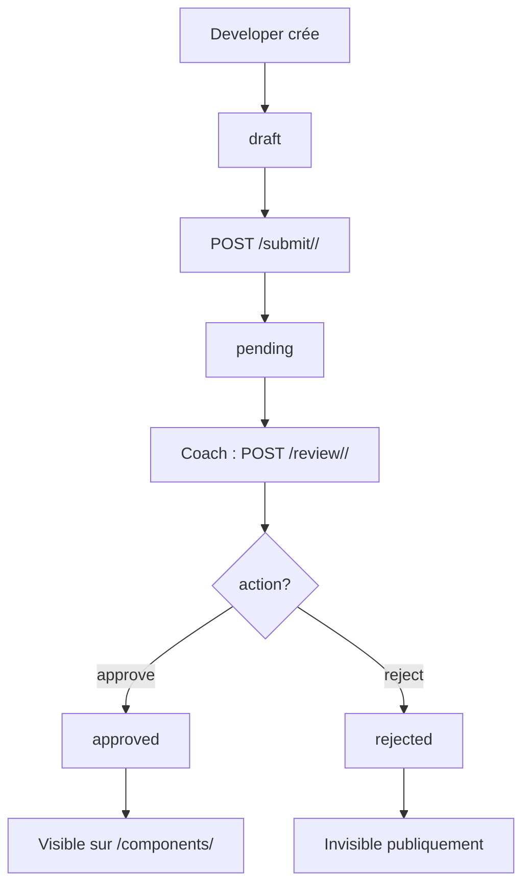

# RedTeamCN – Design System Platform

Une **plateforme moderne de Design System** permettant de **créer, soumettre, valider, partager et gérer** des composants UI réutilisables.

---

## Fonctionnalités

- **Authentification complète** (JWT)
- **Rôles utilisateurs** : `Developer`, `Coach`, `Admin`
- **Workflow de validation** : `draft` → `pending` → `approved` / `rejected`
- **Création, modification, suppression** de composants
- **Système de reviews** (notes + commentaires)
- **Recherche & filtres** (nom, catégorie)
- **Mes composants** (Developer voit tous ses statuts)
- **Mot de passe oublié** (reset par email)
- **Gestion des utilisateurs** (superuser only)
- **API REST complète + Swagger**
- **Prêt pour le frontend** (React, Vue, etc.)

---

## Apps Django

| App | Description | Modèles | Endpoints clés |
|-----|-----------|--------|----------------|
| **`users`** | Gestion des utilisateurs, authentification, rôles | `User` (custom) | `/auth/register/`, `/auth/login/`, `/auth/me/`, `/admin/users/<id>/` |
| **`catalog`** | Gestion des composants UI + validation | `Component` | `/components/`, `/components/create/`, `/components/my/`, `/components/submit/<id>/`, `/components/review/<id>/` |
| **`reviews`** | Système de notation et commentaires | `Review` | `/components/<id>/reviews/`, `/reviews/<id>/` |
| **`tokens`** | (Réservé) Gestion avancée des tokens | — | — |
| **`notifications`** | (À venir) Notifications en temps réel | — | — |
| **`kpi`** | (À venir) Statistiques et métriques | — | — |
| **`audit`** | (À venir) Journal d'activité | — | — |
| **`dashboards`** | (À venir) Tableaux de bord | — | — |
| **`plugins`** | (À venir) Extensions tierces | — | — |

---

## Détail des Apps

### `users` – Authentification & Rôles

- **Modèle** : `User` (hérite de `AbstractUser`)
- **Champs** : `email`, `username`, `first_name`, `last_name`, `organization_name`, `role` (`developer`, `coach`, `admin`)
- **Fonctionnalités** :
  - Inscription (`POST /auth/register/`)
  - Connexion (`POST /auth/login/`)
  - Déconnexion (`POST /auth/logout/`)
  - Profil utilisateur (`GET /auth/me/`)
  - Liste utilisateurs **(superuser only)** (`GET /admin/users/`)
  - **Changer rôle** (`PATCH /admin/users/<id>/` → `{"role": "coach"}`)
  - Mot de passe oublié (`POST /auth/password/reset/` + lien)

---

### `catalog` – Composants UI + Validation

- **Modèle** : `Component`
- **Champs** : `name`, `description`, `category`, `code`, `created_by`, `status`, `created_at`, `updated_at`
- **Statuts** : `draft`, `pending`, `approved`, `rejected`
- **Catégories** (21) : `BUTTON`, `CARD`, `INPUT`, `MODAL`, `ACCORDION`, `SIDEBAR`, `NAVBAR`, `DROPDOWN`, `CAROUSEL`, `CHART`, `TABLE`, `TOAST`, `TOGGLE`, `TEXTAREA`, `SELECT`, `ALERT`, `BADGE`, `BREADCRUMB`, `FORM`, `PAGINATION`, `PROGRESS`

- **Endpoints** :
  - `POST /components/create/` → Créer
  - `GET /components/` → Lister **public** (`approved`)
  - `GET /components/?category=NAVBAR` → Filtrer
  - `GET /components/?search=btn` → Rechercher
  - `GET /components/my/` → **Ses** composants (tous statuts)
  - `POST /components/submit/<id>/` → Soumettre
  - `POST /components/review/<id>/` → Valider / rejeter **(Coach only)**

---

### `reviews` – Avis & Notation

- **Modèle** : `Review`
- **Champs** : `component`, `user`, `rating` (1–5), `comment`, `created_at`, `updated_at`
- **Contraintes** : 1 review par utilisateur/composant
- **Endpoints** :
  - `POST /components/<id>/reviews/` → Ajouter
  - `GET /components/<id>/reviews/` → Lister
  - `DELETE /reviews/<id>/` → Supprimer (seulement le sien)

---

## Workflow de Validation



---

## API Documentation

Swagger UI : [http://127.0.0.1:8000/schema/swagger-ui/](http://127.0.0.1:8000/schema/swagger-ui/)

---

## Configuration Email (Tests)

```python
EMAIL_BACKEND = 'django.core.mail.backends.console.EmailBackend'
```

Les emails de reset de mot de passe s’affichent dans la **console**.

---

## Lancer le projet

```bash
# 1. Cloner
git clone <repo>
cd redteamcn

# 2. Environnement
python -m venv venv
source venv/bin/activate  # Linux/Mac
# venv\Scripts\activate   # Windows

# 3. Installer
pip install -r requirements.txt

# 4. Migrer
python manage.py migrate

# 5. Créer superuser
python manage.py createsuperuser

# 6. Lancer
python manage.py runserver
```

---

## Test avec Postman

1. `POST /api/auth/login/` → Récupérer `access` token
2. Ajouter dans les headers :
   ```
   Authorization: Bearer <token>
   ```

---


**RedTeamCN – Le Design System qui unifie vos équipes.**